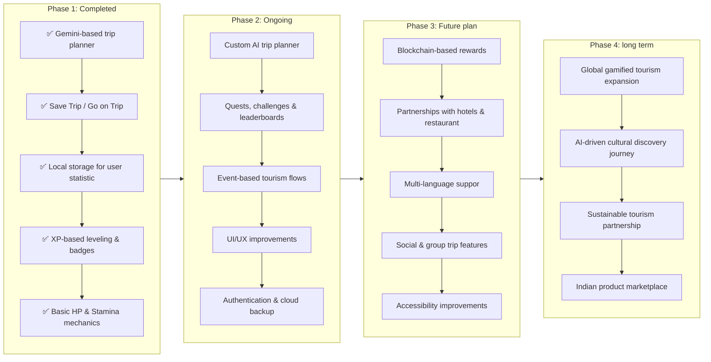
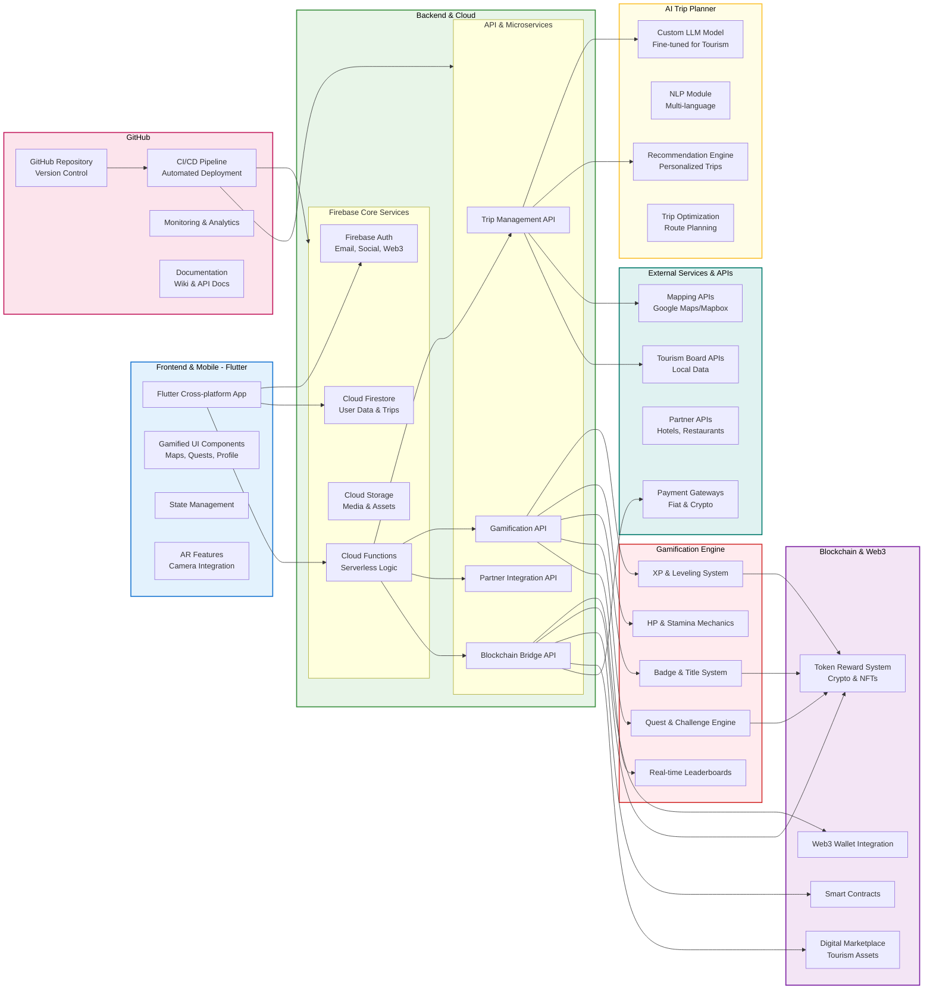

# XP Lore: India Unveiled

# Table of Contents

- [XP Lore: India Unveiled](#xp-lore-india-unveiled)
- [👥 Team – Cluster](#-team--cluster)
- [🎯 Problem Statement](#-problem-statement)
- [🏆 Objective](#-objective)
- [🚀 Project Overview](#-project-overview)
- [⚖ Feasibility Analysis](#-feasibility-analysis)
  - [1. Technical Feasibility](#1-technical-feasibility)
  - [2. Operational Feasibility](#2-operational-feasibility)
  - [3. Economic Feasibility](#3-economic-feasibility)
- [⚔ Potential Challenges and Risks](#-potential-challenges-and-risks)
  - [1. Technical Challenges](#1-technical-challenges)
  - [2. Operational Challenges](#2-operational-challenges)
  - [3. Security \& Privacy Risks](#3-security--privacy-risks)
- [💡 Strategies to Overcome Challenges](#-strategies-to-overcome-challenges)
  - [1. Technical Solutions](#1-technical-solutions)
  - [2. Operational Solutions](#2-operational-solutions)
  - [3. Security \& Compliance](#3-security--compliance)
- [🛣️ Roadmap](#️-roadmap)
- [🧠 Architecture](#-architecture)
- [📈 Impacts and Benefits](#-impacts-and-benefits)
  - [1. Cultural and Social Impact](#1-cultural-and-social-impact)
  - [2. Economic Impact](#2-economic-impact)
  - [3. Technological Impact](#3-technological-impact)
  - [4. Educational and User Engagement Benefits](#4-educational-and-user-engagement-benefits)
  - [5. Scalability and Long-Term Benefits](#5-scalability-and-long-term-benefits)
- [🏗️ Tech Stack](#️-tech-stack)
- [✨ Features (Pre-release)](#-features-pre-release)
- [🔮 Future Enhancements](#-future-enhancements)
- [📸 Screenshots](#-screenshots)
- [📚 Research \& References](#-research--references)
- [🏆 Smart India Hackathon 2025](#-smart-india-hackathon-2025)

A **Smart India Hackathon 2025** project by Team **Cluster** to make exploring India and its culture fun, engaging, and rewarding.

XP Lore gamifies the travel experience, encouraging users to discover Indian traditions, culture, and locally made products. The app integrates **XP-based progression, stamina/HP mechanics, badges, crypto rewards, and AI-powered trip planning** to attract even those who usually don’t find traveling interesting.

## 👥 Team – Cluster

- Najiya Nazrin C N (Team Lead)
- Aswin Asokan
- Bineesha K P
- Krishnapriya M P
- Anasudheen C A
- Shamir Ashraf
 
**PS Number:** SIH25137    
**Category:** Software    
**Theme:** Travel & Tourism   
**Organisation:** AICTE   

## 🎯 Problem Statement

Tourism is one of the largest industries in India, yet many people find traveling uninteresting or lack motivation to explore cultural heritage, traditions, and local products. Existing tourism apps often focus only on navigation, bookings, and itineraries, but fail to provide an immersive and engaging experience.

There is a need for an innovative solution that:
- **Promotes Indian culture and traditions globally** 🌍
- **Motivates even non-travel enthusiasts** through gamification 🎮
- **Supports local businesses and products** by integrating rewards 🛍️
- **Encourages sustainable and participatory tourism** 🌱

## 🏆 Objective

XP Lore aims to:

1. **Gamify Tourism** – Introduce XP, HP, stamina, badges, and levels to make traveling feel like a game.
2. **AI-Powered Trip Planning** – Provide personalized trip plans (pre-release using Gemini, later with a custom AI model).
3. **Reward Engagement** – Offer crypto tokens redeemable at hotels, restaurants, and local stores.
4. **Cultural Promotion** – Highlight Indian traditions, festivals, and locally made products.
5. **Event-Based Tourism** – Encourage visits during cultural festivals (e.g., Onam in Kerala).
6. **Support Local Ecosystem** – Boost local tourism, food, crafts, and hospitality businesses.
7. **Sustainable Exploration** – Promote responsible tourism practices while making exploration fun and participatory.

## 🚀 Project Overview

XP Lore transforms tourism into a **gamified adventure.**
Users can:
- Plan trips using an **AI-powered trip planner** 🧭
- Gain **XP, titles, and badges** 🏆
- Manage **HP & stamina** like in a game 💖⚡
- Replenish stats by visiting **safe houses and local cuisine** 🍲
- Earn **crypto rewards** to redeem at hotels & restaurants 💰
- Experience **event-based** trips (e.g., Kerala during Onam 🌼)
- Save trips and continue journeys later 📍

## ⚖ Feasibility Analysis

### 1. Technical Feasibility
- Built using **Flutter** for cross-platform compatibility (iOS & Android).  
- Backend powered by **Firebase** (authentication, database, storage, serverless functions).  
- **AI Trip Planner** uses a custom LLM-based model for personalized travel recommendations.  
- Gamification mechanics (XP, HP, Stamina, badges, titles) and **Blockchain-based rewards** are implementable with current frameworks and APIs.  
- External integrations like mapping APIs, payment gateways, and partner APIs are widely supported and reliable.  

### 2. Operational Feasibility
- Designed for users of all ages, focusing on **gamified tourism** for easy adoption.  
- Cloud-based backend ensures **scalability**, supporting increasing numbers of users, trips, and events without performance issues.  
- Automated CI/CD pipeline via GitHub enables seamless updates and continuous improvements.  

### 3. Economic Feasibility
- Development using Flutter and Firebase reduces costs compared to separate native apps.  
- Partnerships with hotels, restaurants, and tourism boards can generate revenue or sponsorship opportunities.  
- Blockchain integration adds a unique value proposition to attract users and potential investors.  

## ⚔ Potential Challenges and Risks

### 1. Technical Challenges
- Fine-tuning the **LLM model** for accurate travel recommendations and multi-language support.  
- Integrating **Blockchain rewards** with crypto wallets while ensuring security and compliance.  
- Real-time **gamification mechanics** (XP, HP, Stamina) and leaderboards could create high server load.  
- Handling **offline usage** for users in areas with poor network coverage.  

### 2. Operational Challenges
- Maintaining up-to-date data for tourist locations, events, and partner offers.  
- Encouraging user engagement and retention in a gamified tourism app.  
- Ensuring accessibility and usability for a diverse user base.  

### 3. Security & Privacy Risks
- Protecting user data (personal info, trip history, and crypto wallets).  
- Preventing abuse or fraud in gamification and reward mechanisms.  
- Compliance with regional laws for payments, data storage, and blockchain usage.  

## 💡 Strategies to Overcome Challenges

### 1. Technical Solutions
- Incrementally fine-tune the **LLM model** using user feedback and real trip data.  
- Use **secure APIs and wallet integrations** for blockchain with industry-standard encryption.  
- Optimize backend functions and use **caching** for leaderboards and game mechanics.  
- Enable offline caching for essential trip data and restore sync when network is available.  
- Ensure backend architecture is **scalable** to support growing user base and data volume.  

### 2. Operational Solutions
- Establish **partnerships with tourism boards and hotels** for automated updates on events and offers.  
- Incorporate engaging **quests, challenges, and badges** to boost user retention.  
- Conduct **UX testing** and accessibility audits to ensure the app is intuitive for all users.  

### 3. Security & Compliance
- Encrypt sensitive data and enforce secure authentication.  
- Monitor transactions and gamification usage to detect fraudulent behavior.  
- Keep up with regional legal requirements for payments, crypto, and data privacy.  


## 🛣️ Roadmap  



## 🧠 Architecture



## 📈 Impacts and Benefits

### 1. Cultural and Social Impact
- Promotes **Indian traditions, culture, and heritage** to domestic and international tourists.  
- Encourages users to explore **lesser-known destinations**, helping spread tourism evenly across regions.  
- Raises awareness of **local festivals, cuisine, and handicrafts**, supporting community engagement.  
- Gamification motivates participation, making **tourism appealing even to non-travel enthusiasts**.  

### 2. Economic Impact
- Supports **local businesses**, hotels, and restaurants through partnerships and event-based tourism.  
- Provides an additional revenue stream via the **Blockchain-based rewards system**.  
- Promotes **Indian-made products** through integrated digital marketplaces.  
- Can attract sponsorships, collaborations, and investors due to unique gamified and blockchain-driven tourism approach.  

### 3. Technological Impact
- Demonstrates the application of **AI and LLMs** for personalized travel planning.  
- Showcases **gamification mechanics** (XP, HP, Stamina, badges, titles) in real-world tourism.  
- Integrates **Blockchain and Web3** for secure rewards, digital assets, and crypto payments.  
- Encourages innovation in **mobile travel apps** by combining AI, gamification, and blockchain.  

### 4. Educational and User Engagement Benefits
- Users learn about **Indian culture, history, and geography** while playing the game.  
- Promotes **decision-making, planning, and strategic thinking** through XP-based trip management.  
- Rewards system motivates continuous engagement and exploration.  
- Users earn badges and adventure titles, enhancing **social interaction and gamified achievements**.  

### 5. Scalability and Long-Term Benefits
- Cloud-based architecture ensures **scalability** to millions of users.  
- Framework allows **adding new features** like AR/VR experiences, multi-language support, and global expansion.  
- Lays foundation for **future collaborations** with tourism boards, hotels, restaurants, and cultural organizations.  


## 🏗️ Tech Stack

- **Frontend & Mobile App:** Flutter
- **Version control:** Github
- **Backend:** Local storage (Pre-release), Firebase (Future build) + API integration
- **AI (Trip Planner):** Pre-release(Gemini), Final release(Custom LLM-based model)
- **Gamification Mechanics:** XP, HP, stamina, badges, custom titles
- **Blockchain:** Crypto reward system (planned)

## ✨ Features (Pre-release)

- AI-powered trip planning (Gemini – to be replaced by a custom model)
- Save trip / Go on trip
- Local storage for user statistics
- XP-based level up and adventure titles

Try out the pre-release from [release page](https://github.com/Najiya-Nazrin/Travel-and-Toursim/releases/tag/0.0.1).

## 🔮 Future Enhancements

- 🌐 Shift from Gemini to custom AI model for trip planning
- 🌐 Full integration with blockchain for crypto-based travel rewards
- 🏨 Partnerships with local hotels & restaurants for redeemable offers
- 🎭 Expanded event-based tourism packages (festivals, cultural fairs, etc.)
- 📊 Advanced user analytics & leaderboards
- 🤝 Social features – connect with other explorers

## 📸 Screenshots  

| Home Screen | Trip Planning | Trip Planning |
|-------------|---------------|----------------|
|  |  |  |

| My Trips | Go on Trip | Current Trip |
|-------------|---------------|----------------|
|  |  |  |

## 📚 Research & References

**[1] Xu, Feifei & Weber-Sabil, Jessika & Buhalis, Dimitrios. (2013). Gamification in Tourism. https://doi.org/10.1007/978-3-319-03973-2_38**

```bibtext
@inbook{inbook,
author = {Xu, Feifei and Weber-Sabil, Jessika and Buhalis, Dimitrios},
year = {2013},
month = {01},
pages = {525-537},
title = {Gamification in Tourism},
isbn = {978-3-319-03972-5},
doi = {10.1007/978-3-319-03973-2_38}
}
```

**[2] Chernbumroong, S. et al. (2023). Design of Gamified Crowdsourcing for Tourism Participatory of Urban Problem the Management of Smart City Initiatives. Journal of Mobile Multimedia, 19(6), 1371-1394. doi: 10.13052/jmm1550-4646.1961**

```bibtext
@article{article,
author = {Chernbumroong, Suepphong and Thongthip, Phimphakan and Sirasakamol, Orasa and Jansukpum, Kanjana and Julrode, Phichete and Puritat, Kitti},
year = {2023},
month = {10},
pages = {},
title = {Design of Gamified Crowdsourcing for Tourism Participatory of Urban Problem the Management of Smart City Initiatives},
journal = {Journal of Mobile Multimedia},
doi = {10.13052/jmm1550-4646.1961}
}
```

**[3] Ting, H. et al. (2025). Mobile Gamification's Impact on Tourism Visit Intention. Int J Tourism Res, 27: e70002. https://doi.org/10.1002/jtr.70002**

```bibtext
@article{https://doi.org/10.1002/jtr.70002,
author = {Ting, Hiram and Hwa (Jacky) Cheah, Jun and Tan, Karen and Tham, Aaron and Leong, Quee Ling},
title = {Mobile Gamification's Impact on Tourism Visit Intention},
journal = {International Journal of Tourism Research},
volume = {27},
number = {1},
pages = {e70002},
keywords = {destination choice, game design, mobile gamification, PLS-SEM, technology acceptance model, tourist attitudes and motivations, visit intention},
doi = {https://doi.org/10.1002/jtr.70002},
url = {https://onlinelibrary.wiley.com/doi/abs/10.1002/jtr.70002},
eprint = {https://onlinelibrary.wiley.com/doi/pdf/10.1002/jtr.70002},
note = {e70002 JTR-23-0660.R2},
abstract = {ABSTRACT The present study aims to determine how tourism-related mobile games generate tourism visit intention. Drawing upon the technology acceptance model (TAM), the study seeks to find out the context-specific considerations that exert a greater influence on the intention to visit destinations associated with the mobile game. Using a quantitative approach, data from 263 respondents were collected in Malaysia via an online survey. Partial least-squares structural equation modelling was used to perform latent variable analysis. The findings show the significant effects of perceived ease of play and motivation to play on attitude and intention towards visiting the game destination. In particular, motivation to play is found to exert a greater effect on visit intention. Contradictory results about perceived enjoyment and the importance of motivation are also highlighted. This study adds to the literature that calls for the expansion of the TAM to include context-specific considerations to articulate tourism gamification behaviour and the (un)intended effect on tourism visit intention. Specifically, the importance of context to TAM is unveiled through the motivation to play games related to tourism on a mobile phone. In contrast, this study points to the negligible influence of perceived enjoyment of games on intention to visit.},
year = {2025}
}

```

**[4] Thees, Hannes et al. (2020). The Application of Blockchain in Tourism: Use Cases in the Tourism Value System. European Journal of Tourism Research, 26. doi: 10.54055/ejtr.v26i.1933**

```bibtext
@article{article,
author = {Thees, Hannes and Erschbamer, Greta and Pechlaner, Harald},
year = {2020},
month = {08},
pages = {},
title = {The Application of Blockchain in Tourism: Use Cases in the Tourism Value System.},
volume = {26},
journal = {European Journal of Tourism Research},
doi = {10.54055/ejtr.v26i.1933}
}
```

**[5] Baydeniz, Erdem. (2024). Blockchain Technology in Tourism: Pioneering Sustainable and Collaborative Travel Experiences. Journal of Tourismology. doi: 10.26650/jot.2024.10.1.1312994**

```bibtext
@article{article,
author = {Baydeniz, Erdem},
year = {2024},
month = {04},
pages = {},
title = {Blockchain Technology in Tourism: Pioneering Sustainable and Collaborative Travel Experiences},
journal = {Journal of Tourismology},
doi = {10.26650/jot.2024.10.1.1312994}
}
```

## 🏆 Smart India Hackathon 2025

This project was developed as part of **SIH 2025** under the theme **Travel & Tourism.**
